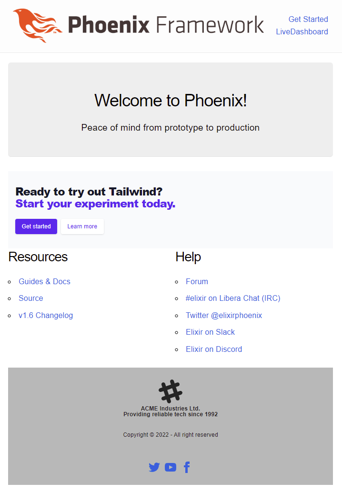

# phoenix-dartSass-tailwind-daisyUI (PDTD)

This is a demo of incorporating the following tech stacks with newly generated phoenix project:

- DartSass
- TailwindCSS
- DaisyUI



This phoenix project was generated using following command:

```shell
mix phx.new pdtd --no-ecto --no-mailer
```

>! Note: This version of phoenix already dropped webpack for Esbuild.

## Env

You need the following:

```shell
❯ elixir -v
Erlang/OTP 25 [erts-13.0] [source] [64-bit] [smp:12:12] [ds:12:12:10] [async-threads:1] [jit:ns]

Elixir 1.13.4 (compiled with Erlang/OTP 25)

❯ mix phx -v
Phoenix v1.6.9

❯ node -v
v18.0.0

❯ pnpm -v
7.1.5
```

## For the First time

Run mix task to setup

```shell
mix setup
```

Or manually get dependencies

```shell
mix deps.get
cd assets && pnpm i && cd ..
```

### To Run

Start dev server

```shell
mix phx.server
```

Or run inside IEx

```shell
iex -S mix phx.server
```

Visit [`localhost:4000`](http://localhost:4000) to see result.

## Tailwind & DaisyUI

Check `lib/templates/page/index.html.heex`.

The CTA Section is using example from [tailwind UI](https://tailwindui.com/components/marketing/sections/cta-sections).

The footer is using example from [daisyUI](https://daisyui.com/components/footer/).

## Code auto format

Code auto format includes `.heex`. See `.formatter.exs`

```shell
mix format
```

## To deploy

Ready to run in production? Please [check our deployment guides](https://hexdocs.pm/phoenix/deployment.html).

## Learn more

  * Official website: https://www.phoenixframework.org/
  * Guides: https://hexdocs.pm/phoenix/overview.html
  * Docs: https://hexdocs.pm/phoenix
  * Forum: https://elixirforum.com/c/phoenix-forum
  * Source: https://github.com/phoenixframework/phoenix
